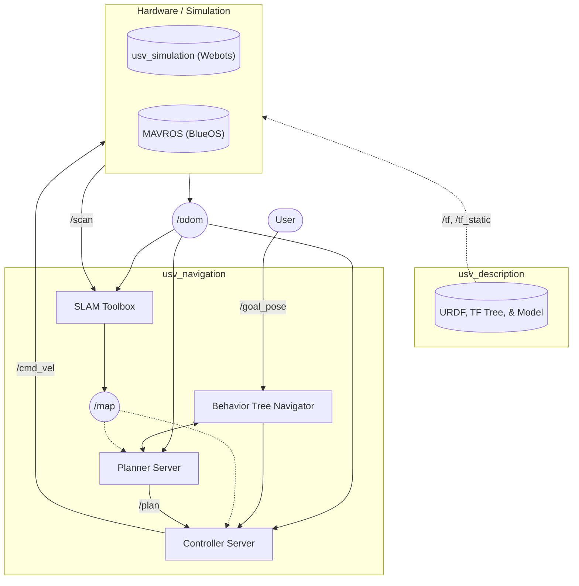

A Webots simulation of a differential-drive aquatic robot navigating complex obstacle environments with fluid dynamics. Uses ROS 2 Nav2 for path planning and control, with SLAM Toolbox for real-time map building from LiDAR data.

### Architecture
- **`usv_simulation`** — Webots controller bridge that publishes GPS/IMU odometry, LiDAR scans, and translates Nav2 `cmd_vel` into differential propeller commands
- **`usv_navigation`** — Nav2 bringup with a tuned Hybrid A* planner (SmacPlannerHybrid with Reeds-Shepp curves), Regulated Pure Pursuit controller, and SLAM Toolbox for online map building
- **`usv_description`** — URDF model and TF tree

### Technical Details
- Nav2 is configured to use a Hybrid A* path planner that uses Reeds-Shepp curves for branching heuristics and a Pure Pursuit controller. SLAM Toolbox is used for processing LiDAR sensor data to dynamically update a costmap.
- The controller can handle a slight current force from the Fluid object (streamVelocity), but I've found it struggles to stay aligned to the path around >0.05 streamVelocity on the X and Y axes. There's likely some improvements to be made, but most of the error is that standard Pure Pursuit treats all angles of movement to be equal and doesn't account for force dynamics.
- When the robot turns too quickly (especially during a lag spike as explained above), the physics engine causes the boat to roll slightly. This causes the 2D plane that the Lidar scans upon to be angled. A tilt threshold filter suppresses scan publishing when roll/pitch exceeds 10 degrees.
- A custom behavior tree replaces Nav2's default Spin recovery with a "BackUp" behavior that makes the boat reverse away from walls/obstacles and replan.
- This project originally was made without Nav2! I've since updated it to better make use Nav2 and ROS as a whole, but the original code is still available in the `old_code` branch.
- `main.launch.py` has a `use_sim` toggle. If false, `hardware_launch.py` is used which launches a MAVROS node. It sends standard `/cmd_vel` Twist msgs over MAVLink to an ArduRover flight controller onboard a physical BlueBoat. (hasn't been tested on actual hardware yet, but it should theoretically work.)

### Credits
- Reference for fluid physics in Webots: [silvery107/auto-docking-vessels](https://github.com/silvery107/auto-docking-vessels)
- Pure Python implementation of Reeds-Shepp pathing: [AtsushiSakai/PythonRobotics](https://github.com/AtsushiSakai/PythonRobotics)
- BlueOS integration plugin: [itskalvik/blueos-ros2](https://github.com/itskalvik/blueos-ros2)
- BlueBoat vehicle (where I got the CAD model from): [BlueBoat](https://bluerobotics.com/store/boat/blueboat/blueboat/)
